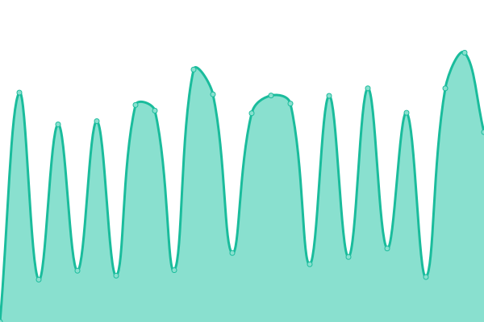
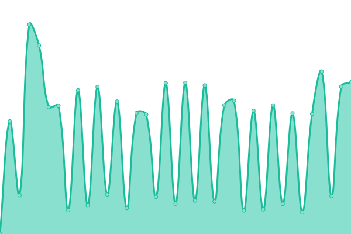
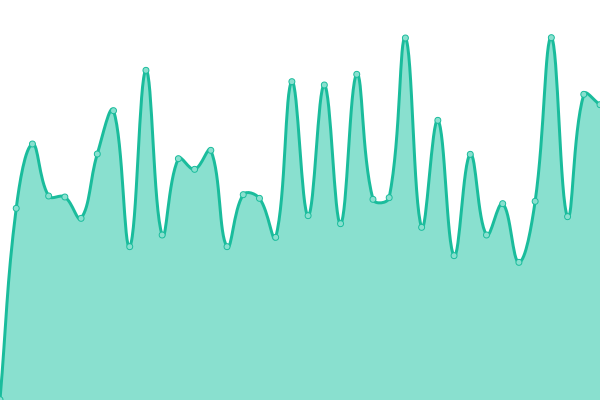
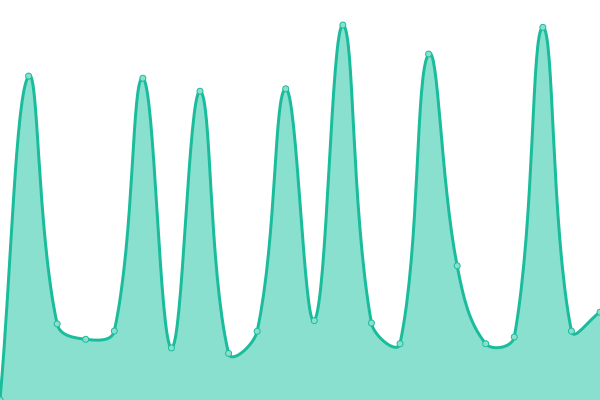

# [📈 Live Status](https://demo.upptime.js.org): <!--live status--> **🟧 Partial outage**

This repository contains the open-source uptime monitor and status page for [Auto-mat z.s.](https://auto-mat.cz), powered by [Upptime](https://github.com/upptime/upptime).

With [Upptime](https://upptime.js.org), you can get your own unlimited and free uptime monitor and status page, powered entirely by a GitHub repository. We use [Issues](https://github.com/upptime/upptime/issues) as incident reports, [Actions](https://github.com/auto-mat/automat-statuspage/actions) as uptime monitors, and [Pages](https://demo.upptime.js.org) for the status page.

<!--start: status pages-->
<!-- This summary is generated by Upptime (https://github.com/upptime/upptime) -->
<!-- Do not edit this manually, your changes will be overwritten -->
<!-- prettier-ignore -->
| URL | Status | History | Response Time | Uptime |
| --- | ------ | ------- | ------------- | ------ |
|  [Automat hlavní stranka § auto-mat.cz](https://auto-mat.cz) | 🟥 Down | [automat-hlavni-stranka-auto-mat-cz.yml](https://github.com/auto-mat/automat-statuspage/commits/HEAD/history/automat-hlavni-stranka-auto-mat-cz.yml) | 

 1314ms
     
 | 

<a href="https://auto-mat.github.io/automat-statuspage/history/automat-hlavni-stranka-auto-mat-cz">84.40%</a>
    

|  [Automat eshop § obchod.auto-mat.cz](https://obchod.auto-mat.cz/) | 🟩 Up | [automat-eshop-obchod-auto-mat-cz.yml](https://github.com/auto-mat/automat-statuspage/commits/HEAD/history/automat-eshop-obchod-auto-mat-cz.yml) | 

 1377ms
     
 | 

<a href="https://auto-mat.github.io/automat-statuspage/history/automat-eshop-obchod-auto-mat-cz">100.00%</a>
    

|  [Cyklisté sobě § www.cyklistesobe.cz](https://www.cyklistesobe.cz/) | 🟥 Down | [cykliste-sobe-www-cyklistesobe-cz.yml](https://github.com/auto-mat/automat-statuspage/commits/HEAD/history/cykliste-sobe-www-cyklistesobe-cz.yml) | 

 1557ms
     
 | 

<a href="https://auto-mat.github.io/automat-statuspage/history/cykliste-sobe-www-cyklistesobe-cz">84.43%</a>
    

|  [Do Práce na Kole § dopracenakole.cz](https://dopracenakole.cz) | 🟥 Down | [do-prace-na-kole-dopracenakole-cz.yml](https://github.com/auto-mat/automat-statuspage/commits/HEAD/history/do-prace-na-kole-dopracenakole-cz.yml) | 

 624ms
     
 | 

<a href="https://auto-mat.github.io/automat-statuspage/history/do-prace-na-kole-dopracenakole-cz">84.46%</a>
    

|  [Do Práce na Kole - reg § dpnk.dopracenakole.cz](https://dpnk.dopracenakole.cz) | 🟩 Up | [do-prace-na-kole-reg-dpnk-dopracenakole-cz.yml](https://github.com/auto-mat/automat-statuspage/commits/HEAD/history/do-prace-na-kole-reg-dpnk-dopracenakole-cz.yml) | 

 673ms
     
 | 

<a href="https://auto-mat.github.io/automat-statuspage/history/do-prace-na-kole-reg-dpnk-dopracenakole-cz">100.00%</a>
    

|  [Do Práce na Kole - reg test § test.dopracenakole.cz](https://test.dopracenakole.cz) | 🟥 Down | [do-prace-na-kole-reg-test-test-dopracenakole-cz.yml](https://github.com/auto-mat/automat-statuspage/commits/HEAD/history/do-prace-na-kole-reg-test-test-dopracenakole-cz.yml) | 

 0ms
     
 | 

<a href="https://auto-mat.github.io/automat-statuspage/history/do-prace-na-kole-reg-test-test-dopracenakole-cz">0.00%</a>
    

|  [Městem na Kole § mestemnakole.cz](https://mestemnakole.cz) | 🟩 Up | [mestem-na-kole-mestemnakole-cz.yml](https://github.com/auto-mat/automat-statuspage/commits/HEAD/history/mestem-na-kole-mestemnakole-cz.yml) | 

 1100ms
     
 | 

<a href="https://auto-mat.github.io/automat-statuspage/history/mestem-na-kole-mestemnakole-cz">100.00%</a>
    

|  [Mapa Městem na Kole § mapa.prahounakole.cz](https://mapa.prahounakole.cz) | 🟩 Up | [mapa-mestem-na-kole-mapa-prahounakole-cz.yml](https://github.com/auto-mat/automat-statuspage/commits/HEAD/history/mapa-mestem-na-kole-mapa-prahounakole-cz.yml) | 

 1217ms
     
 | 

<a href="https://auto-mat.github.io/automat-statuspage/history/mapa-mestem-na-kole-mapa-prahounakole-cz">100.00%</a>
    

|  [Geoserver § geoserver1.prahounakole.cz](https://geoserver1.prahounakole.cz) | 🟩 Up | [geoserver-geoserver1-prahounakole-cz.yml](https://github.com/auto-mat/automat-statuspage/commits/HEAD/history/geoserver-geoserver1-prahounakole-cz.yml) | 

 674ms
     
 | 

<a href="https://auto-mat.github.io/automat-statuspage/history/geoserver-geoserver1-prahounakole-cz">100.00%</a>
    

|  [Dlaždice pro mapu](https://tiles.prahounakole.cz/) | 🟩 Up | [dlazdice-pro-mapu.yml](https://github.com/auto-mat/automat-statuspage/commits/HEAD/history/dlazdice-pro-mapu.yml) | 

 572ms
     
 | 

<a href="https://auto-mat.github.io/automat-statuspage/history/dlazdice-pro-mapu">100.00%</a>
    

|  [Zažit Město Jinak § zazitmestojinak.cz](https://zazitmestojinak.cz) | 🟥 Down | [zazit-mesto-jinak-zazitmestojinak-cz.yml](https://github.com/auto-mat/automat-statuspage/commits/HEAD/history/zazit-mesto-jinak-zazitmestojinak-cz.yml) | 

 639ms
     
 | 

<a href="https://auto-mat.github.io/automat-statuspage/history/zazit-mesto-jinak-zazitmestojinak-cz">84.45%</a>
    

|  [Passbolt § automat.passbolt.klub-pratel.cz](https://automat.passbolt.klub-pratel.cz) | 🟩 Up | [passbolt-automat-passbolt-klub-pratel-cz.yml](https://github.com/auto-mat/automat-statuspage/commits/HEAD/history/passbolt-automat-passbolt-klub-pratel-cz.yml) | 

 1121ms
     
 | 

<a href="https://auto-mat.github.io/automat-statuspage/history/passbolt-automat-passbolt-klub-pratel-cz">100.00%</a>
    

|  [Klub Přatel - Automat § automat.klub-pratel.cz](https://automat.klub-pratel.cz) | 🟩 Up | [klub-pratel-automat-automat-klub-pratel-cz.yml](https://github.com/auto-mat/automat-statuspage/commits/HEAD/history/klub-pratel-automat-automat-klub-pratel-cz.yml) | 

 1042ms
     
 | 

<a href="https://auto-mat.github.io/automat-statuspage/history/klub-pratel-automat-automat-klub-pratel-cz">100.00%</a>
    

|  [Klub Přatel - Brontosaurus § brontosaurus.klub-pratel.cz](https://brontosaurus.klub-pratel.cz) | 🟥 Down | [klub-pratel-brontosaurus-brontosaurus-klub-pratel-cz.yml](https://github.com/auto-mat/automat-statuspage/commits/HEAD/history/klub-pratel-brontosaurus-brontosaurus-klub-pratel-cz.yml) | 

 0ms
     
 | 

<a href="https://auto-mat.github.io/automat-statuspage/history/klub-pratel-brontosaurus-brontosaurus-klub-pratel-cz">100.00%</a>
    

|  [Klub Přatel - Investigace § investigace.klub-pratel.cz](https://investigace.klub-pratel.cz) | 🟥 Down | [klub-pratel-investigace-investigace-klub-pratel-cz.yml](https://github.com/auto-mat/automat-statuspage/commits/HEAD/history/klub-pratel-investigace-investigace-klub-pratel-cz.yml) | 

 0ms
     
 | 

<a href="https://auto-mat.github.io/automat-statuspage/history/klub-pratel-investigace-investigace-klub-pratel-cz">0.00%</a>
    

|  [Klub Přatel - Test § test.klub-pratel.cz](https://test.klub-pratel.cz) | 🟥 Down | [klub-pratel-test-test-klub-pratel-cz.yml](https://github.com/auto-mat/automat-statuspage/commits/HEAD/history/klub-pratel-test-test-klub-pratel-cz.yml) | 

 437ms
     
 | 

<a href="https://auto-mat.github.io/automat-statuspage/history/klub-pratel-test-test-klub-pratel-cz">0.00%</a>
    

|  [Limesurvey § limesurvey.dopracenakole.net](https://limesurvey.dopracenakole.net) | 🟩 Up | [limesurvey-limesurvey-dopracenakole-net.yml](https://github.com/auto-mat/automat-statuspage/commits/HEAD/history/limesurvey-limesurvey-dopracenakole-net.yml) | 

 985ms
     
 | 

<a href="https://auto-mat.github.io/automat-statuspage/history/limesurvey-limesurvey-dopracenakole-net">100.00%</a>
    

<!--end: status pages-->

[**Visit our status website →**](https://auto-mat.github.io/automat-statuspage/)

## 📄 License

- Powered by: [Upptime](https://github.com/upptime/upptime)
- Code: [MIT](./LICENSE) © [Upptime](https://upptime.js.org)
- Data in the `./history` directory: [Open Database License](https://opendatacommons.org/licenses/odbl/1-0/)
